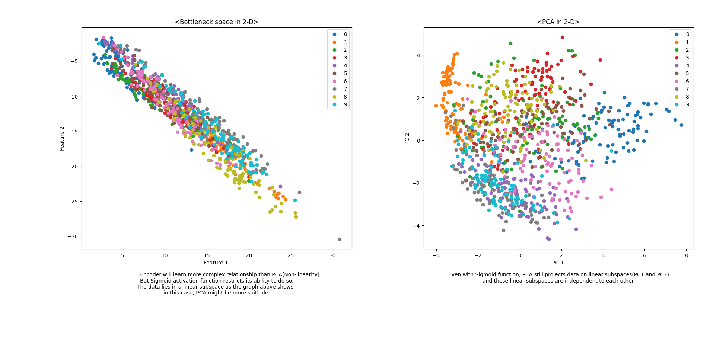
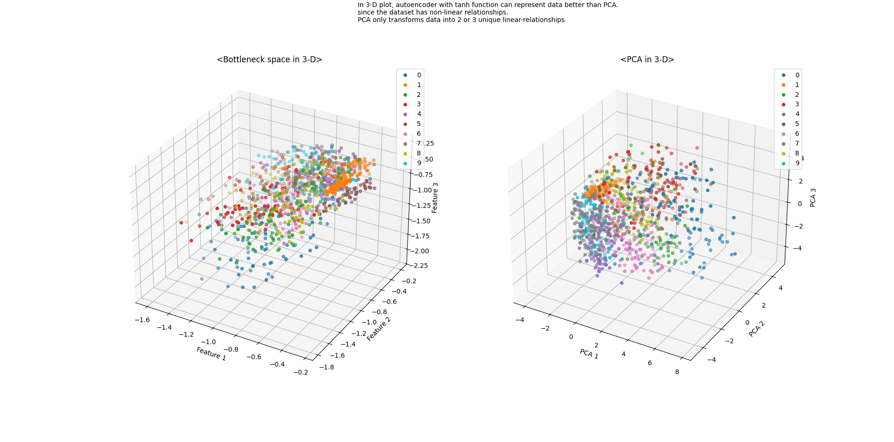
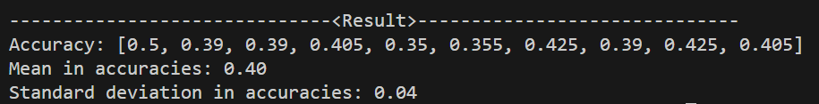
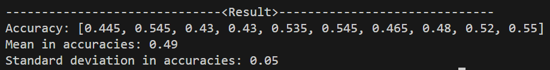
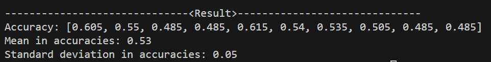

# Assignment3
This is Assignment 3 by Jinho Nam for CS 4850 (Foundation of AI) course.

## How to set up the environment
The dependencies for this project are listed in `requirements.txt`. Python virtual environment will install all of the items within the file.

1. Clone this repository.
2. Navigate to the cloned project directory.
3. Create a Python virtual environment.
    - `python -m venv .venv`
4. Activate the virtual environment.
    - For Linux, `source ./.venv/bin/activate`
    - For Windows, `.\.venv\Scripts\activate\`
5. Install dependencies
    - `pip install -r requirements.txt`

## What code to run
This is the instruction what code to run to get the answers for questions in [PDF file](Assignment3_Description.pdf). If the Python virtual environment and the dependencies are installed succesfully, this instruction will give the result as supposed.

- Question 1
    - `simpleAutoencoder.py` and `Q1.py` are the corresponding files for the answers.
    - For the 2-D plot, refer to the lines 32 and 33 in `Q1.py`.
    - For the 3-D plot, refer to the lines 106 and 107 in `Q1.py`.  
    - Example output (2-D plots):
        
    - Example output (3-D plots):
        
        >  The output plots are also at [here](./results_images) as .png file.

- Question 2
    - `simpleAutoencoder.py` and `Q2.py` are corresponding files for the answers.
    - To see the result of model 1 with layers `d → 50 → 2 → 50 → d`, refer to lines 23-25 and 58-61 in `simpleAutoencoder.py`, and run `Q2.py`.
    - To see the result of model 2 with layers `d → 100 → 50 → 2 → 50 → 100 → d`, refer to lines 28 and 32 and 64-69 in `simpleAutoencoder.py`, and run `Q2.py`.
    - To see the result of model 3 with layers `d → 200 → 100 → 50 → 2 → 50 → 100 → 200 → d`, refer to lines 35-41 and lines 72-79, and run `Q2.py`
    - Example output (model 1):
        
    - Example output (model 2):
        
    - Example output (model 3):
        
        >  The outputs are also at [here](./results_images) as .png file.

